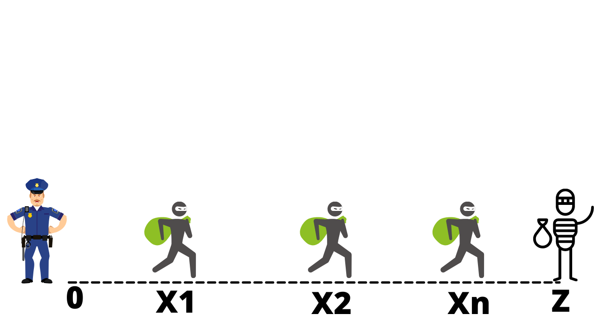

<h1 align="Center">👮🏻 Police-man and thieves 🎭</h1>
<h4>Question 5</h4>

There are one Police inspector, k thieves🎭, and one point of extraction 🚁 **‘Z’** on a coordinate line. The police inspector👮🏻 is located at point 0, the point **'Z’**  is located at point n. All thieves🎭 are located between the police inspector and point **‘Z’**. the ***i*-th** thief🎭 is located at the point **x****i** (0<x*i*<n).
At each point, many thieves🎭 can be located.   
In one second⌛, the following happens. 
First, **exactly one** thief🎭 moves to the right by 1. If the thief🎭 reaches the point ‘Z’, it hides 🚁(i.e. the thief will not any more move to any point and will not be caught by police-man). Then (after that the thief has finished its move) the Policeman👮🏻 moves to the right by 1. If at the new position of policeman, some thieves are located, the police-man👮🏻 shoots them ☠️(they will not be able to move after that). The actions are performed until any thief hasn't been hidden or isn't killed). 
In other words, the first move is made by a thief🎭. If the thief has reached the point ’**Z**’, it's saved. Then the policeman👮🏻 makes a move. The policeman shoots☠️ all the thieves located at the point the policeman has reached (if the policeman has reached the Point of extraction, he kills nobody as everyone already extracted 🚁). 
Each second, you can select a thief that will make a move. What is the maximum number of thieves🎭 that can reach the point ‘**Z**’ safely? 
 

 

<strong>Input</strong>

The first line contains one integer t (1≤t≤1e4) — the number of test cases. Then t test cases follow.Each test case consists of two lines. The first line contains two integers n and k (**2≤n≤1e9**, **1≤k≤4e5**). The second line contains k integers x*1*,x*2*,…x*k* (**1≤xi<n**) — 
the initial coordinates of the thieves🎭.It is guaranteed that the sum of all k given in the input doesn't exceed 4e5.

<strong>Output</strong>

For each test case output on a separate line an integer *m* (**m≥0**) — the maximum number of thieves that can reach the point ’**Z**’ without being killed.

 

<strong>Example :

Input: 
3 
10 6 
8 7 5 4 9 4 
2 8 
1 1 1 1 1 1 1 1 
12 11 
1 2 3 4 5 6 7 8 9 10 11 

Output: 
3 
1 
4 
 

</strong>

 

Must follow [`Rules`](https://github.com/dscuietkuk/Commit-Ur-Code/#-rules-you-should-follow-%EF%B8%8F-)
 
Also Your submissions will not be considered After <strong>11:50 pm 🕛 15-10-2021 </strong>
